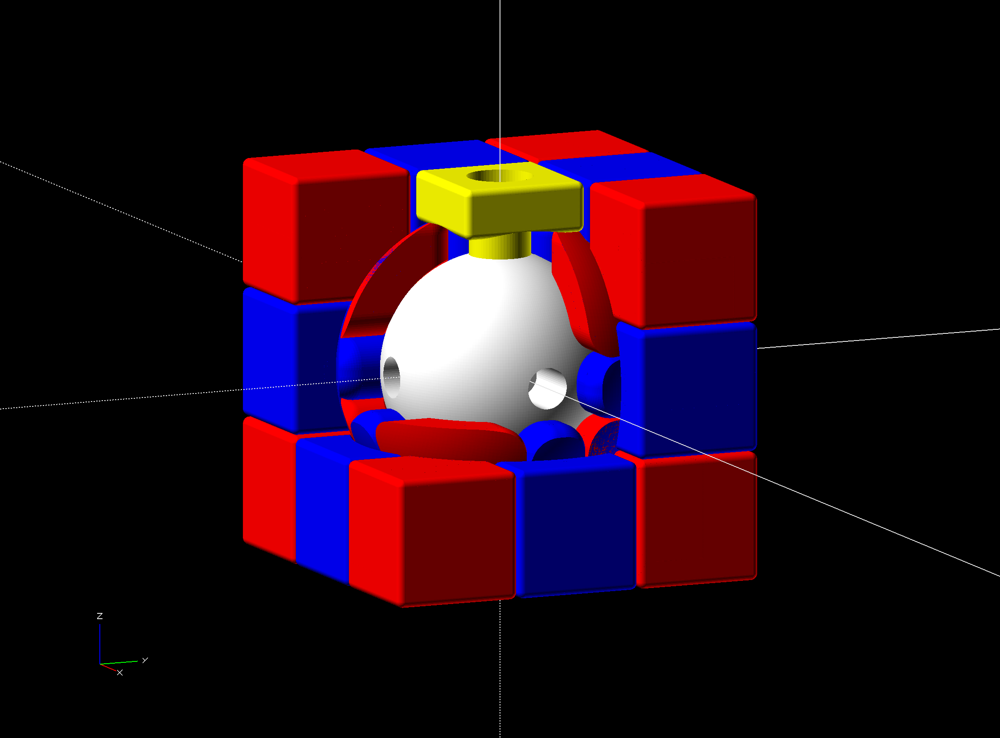

# 3x3x3 Cube Puzzle

## Parts

The pieces are sliced into parts to make 3D printing easier by minimizing
overhangs. The parts each contain one external square, so they can be 3D printed
in the desired color without stickers or painting.

## Printing

Use 6 different colors of filament.

 - (2) core parts (any color)
 - (6) middle parts (1 of each color)
 - (24) edge parts (4 of each color)
 - (24) corner parts (4 of each color)

## Assembly

 1. Glue the 2 core parts together such that the holes in one half are centered
    between the holes in the other half.

**Strategy #1: Glue the parts together and assemble as pieces**

 1. Glue the side pieces together in sets of 2 such that each side of the cube
    gets one color.
 2. Glue the corner pieces together in sets of 3 such that each side of the cube
    gets one color.
 3. Screw a center piece to the bottom of the core.
 4. Insert 4 corner pieces into the bottom center piece.
 5. Insert 4 edge pieces between each corner piece.
 6. Screw a center piece into each of the 4 sides of the core.
 7. Insert an edge piece between each of the 4 center pieces.
 8. Insert a corner piece above each edge piece.
 9. Insert an edge piece between each corner.
 10. Screw a center piece to the top of the core.

**Strategy #2: Assemble the parts loosely**

 1. Screw a center part to the bottom of the core.
 2. Insert 4 corner parts into the bottom center part.
 2. Insert 4 edge parts between each corner part.
 3. Secure the other 4 halves of the bottom edge parts by holding an edge part
    in place with one hand and screwing a center part into the side of the core
    above it with the other hand.
 4. Finish each bottom corner by holding 2 corner parts in place with one hand
    and inserting 2 edge parts above them with the other hand.
 5. Insert 3 corner parts above each edge piece.
 6. Insert 2 edge parts between each corner.
 7. Screw a center part to the top of the core.
