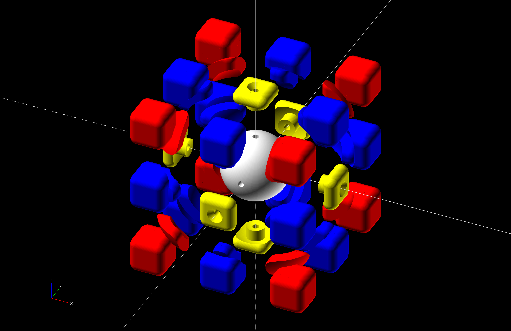

# 3x3x3 Cube Puzzle

## Printing

Use 6 different colors of filament.

 - (1) core piece
 - (6) middle pieces
 - (8) corner pieces
 - (12) edge pieces

## Assembly

 1. Screw five of the center pieces to the core.
 2. Insert 4 corner pieces into the bottom center piece.
 3. Insert 4 edge pieces between each corner piece.
 4. Insert an edge piece between each of the 4 center pieces.
 5. Insert a corner piece above each edge piece.
 6. Insert an edge piece between each corner.
 7. Screw a center piece to the top of the core.
 8. Color sides
